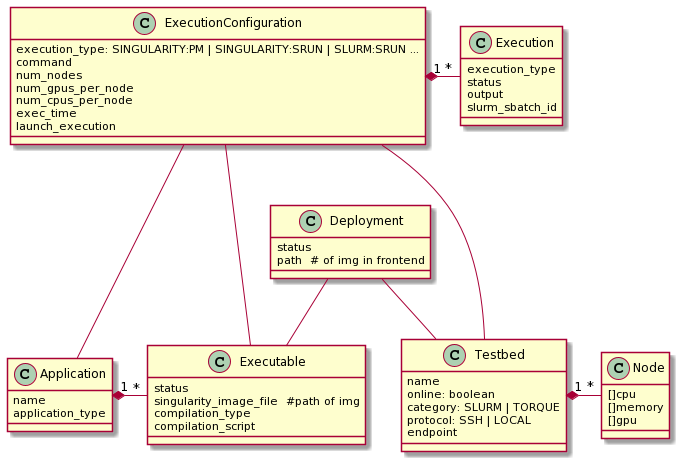

# Class diagram

* Testbed. An HPC testbed, managed by Slurm or Torque workload manager. Two types: local and remote. In case of remote, ALDE connects to it using ssh using the endpoint field; so commands are ssh testbed.endpoint command (e.g. ssh ubuntu@alde srun singularity run /tmp/image.img). This means the user running the ALDE process has its public key stored in the authorized_keys in the frontend.

* Node. Definition of nodes in the testbed. ALDE gets the nodes from the workload manager and is able to connect to the nodes to get additional information.

* Application. Root entity for an application.

* Executable. Holds path of singularity image in alde server. It can be created in two ways:
  * Generating the singularity image (see above), uploading the application code and specifying the definition template to use.
  * Posting directly the entity to the REST API.

* Deployment. Creating a deployment triggers a deployment of an Executable (i.e., the singularity image in the ALDE server) to the frontend node. The result is that the image in the ALDE server is copied to the frontend node. As with the Executable, the Deployment can be created posting all the information, so the file is not copied to the frontend node, but the request already contains the path in the node where an image is stored.

* ExecutionConfiguration. Contains additional information about how to execute an application (needed resources, command to run…). The execution_type states the command to be sent to the workload manager to actually execute the application. The application is run where the field launch_execution is set to true (so a PATCH to the entity may be needed).

* Execution. Holds information about a single execution of an application, including the status.